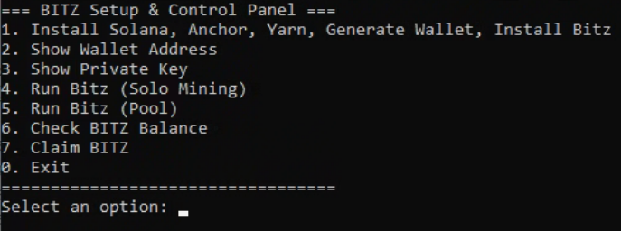
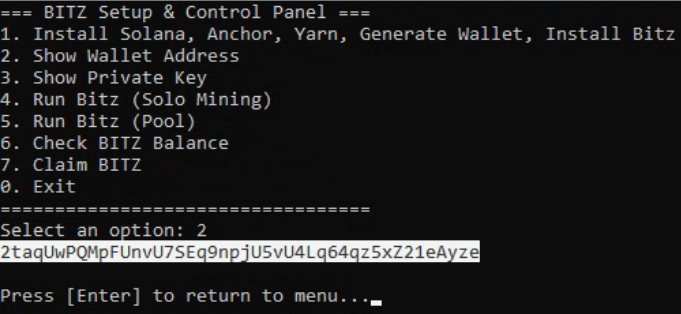
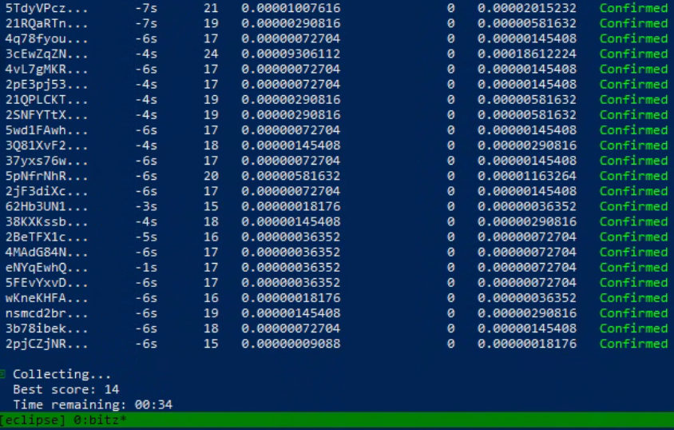
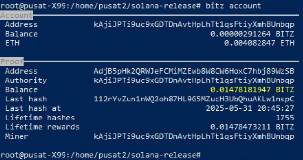

# Bitz Mining (*Eclipse*)
**Bitz** adalah token di jaringan **Eclipse**. Mari mulai menambang selagi masih awal! Menurut saya, **BITZ berpotensi meroket** tahun ini. Mining dan staking cukup menggunakan **1 core CPU**.<br><br>
**Bitz** is a token on the **Eclipse** network. Let’s start mining early — in my opinion, BITZ has great potential to rise this year. Mining and staking only require **1 CPU core**.

### Clone this repo & extrac to local
```
apt update && apt install -y wget unzip && wget https://github.com/kajijp/eclipse-bitz-mining/archive/refs/heads/main.zip && unzip main.zip && mv eclipse-bitz-mining-main eclipse-bitz && cd eclipse-bitz && chmod +x setup-bitz.sh && ./setup-bitz.sh
```
### Setup list
Choose option 1 to install all dependencies: (Be Patient, it will be take several minutes)<br>


### Fund Wallet
- Choose option 2 to show your **Wallet Address**.
- Choose option 3 to reveal your **Private Key**.<br>

> ⚠️ **IMPORTANT:** You must fund your wallet with at least **0.0005 ETH** before starting the miner.  
> This balance is required to perform **claim** and **collect** operations for BITZ.

You can bridge ETH from Base, Arbitrum, Optimism, or others using [Eclipse Bridge (orbiter)](https://orbiter.finance/?channel=0x9443ab364194ecdc306d7229d97341e79c8b5b4a).

### Running Bits Miner
After you funding your wallet, choose 4 for solo mining or 5 for mining with pool.<br>


### Account Balance
Choose 6 for showing account information about balance and other.<br>

